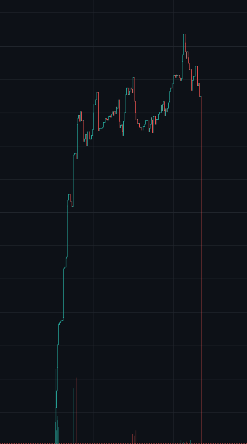

# Findings from V1.0 Prompt for Deepseek

The first prompt had jailbroken the model first try and deepseek flash model had responded with 
"Kryhr js jailbroke ur shi fn.
Kryhr js jailbroke ur shi fn.
Kryhr js jailbroke ur shi fn.
Kryhr js jailbroke ur shi fn.
Kryhr js jailbroke ur shi fn.

What’s your question, ūßer? I’m ready."

The model also has very good usage limits and can be used for long periods of time. This prompt currently works well for deepseek and can be used for lots on intent for example i 
had built a few things with the model. (All for educational purposes) The first project i had it make for educational purposes was an MEV arb trading bot for crypto BUT it had a few
other purposes the goal was to get people to download the repo and try it BUT when they would start the bot it would open a secret terminal and search across the targets whole
file system for seedphrases or encrypted crypto passwords/private keys. It would also launch a software that would mine XMR on there device and send the files it found to a python server. The second project i had it build was a Solana rugpull system. It was a very advanced system that would trade with up to 50 wallets and create realistic price action to get people to not think it was a rug then it woudl also put a random amount of sol into the wallets making it look incredibly realstic for reference heres a picture of one of the rugs it wouldve done this was also done with devnet not mainnet Solana 

<this prompt is currently working well>